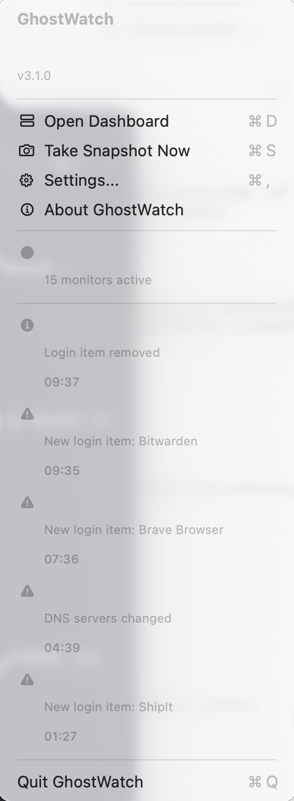
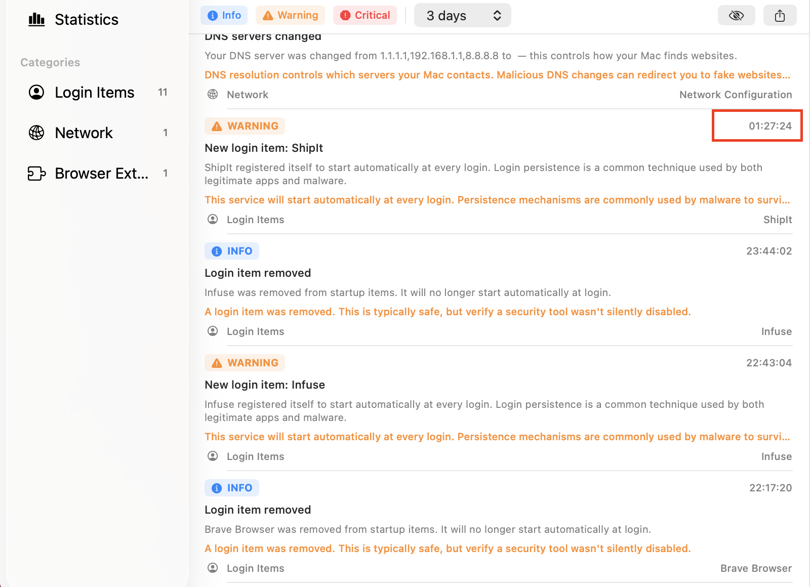

<p align="center">
  
</p>

<h1 align="center">GhostWatch</h1>

<p align="center">
  <strong>Silent Mac security monitor</strong><br>
  Detects unauthorized changes to your system — before you notice them.
</p>

<p align="center">
  
  
  
  
</p>

---

## What is GhostWatch?

GhostWatch is a lightweight macOS menu bar application that continuously monitors critical system settings and alerts you when something changes. It runs silently in the background and notifies you if an app, script, or attacker modifies your security configuration.

**No account required. No data sent anywhere. Everything stays on your Mac.**

## Features

### 15 Security Monitors

| Category | What it watches |
|----------|----------------|
| **Launch Services** | LaunchAgents & LaunchDaemons (persistence mechanisms) |
| **Login Items** | Apps that start at login |
| **Hosts File** | DNS overrides in `/etc/hosts` |
| **System Security** | SIP status, Secure Boot, FileVault |
| **Privacy Permissions** | Camera, microphone, screen recording (TCC database) |
| **Network Configuration** | DNS servers and proxy settings |
| **Firewall** | macOS firewall status and rules |
| **Scheduled Tasks** | Cron jobs |
| **Configuration Profiles** | MDM and configuration profiles |
| **Browser Extensions** | Chrome, Firefox, Edge, Brave, Arc extensions |
| **System Extensions** | Kernel and system extensions |
| **SSH Keys** | Authorized keys and key files in `~/.ssh` |
| **User Accounts** | Local user accounts |
| **Sharing Preferences** | Remote Login, Screen Sharing, File Sharing |
| **XProtect** | Apple's built-in malware definitions version |

### Dashboard

- Real-time event timeline with severity indicators (Info / Warning / Critical)
- Filter by category, severity, date range (Today, 3 days, 7 days, 30 days, All)
- Full-text search across events
- Bookmark and dismiss events
- Statistics with charts (7-day trend, category distribution, top apps)
- Export to JSON, CSV, or HTML

### Other

- Menu bar integration with recent events overview
- macOS native notifications
- Bilingual: English and French
- Automatic data retention policy (configurable)
- Lightweight — minimal CPU and memory usage

## Screenshots

<p align="center">
  
  
</p>

## Installation

### Download

1. Download the latest `.dmg` from the [Releases](../../releases) page
2. Open the `.dmg` file
3. Drag **GhostWatch** to your **Applications** folder
4. Launch GhostWatch from Applications

### Grant Permissions

GhostWatch needs specific macOS permissions to monitor your system effectively. On first launch, you'll be guided through the setup, but you can also configure them manually:

#### Full Disk Access (Recommended)

Required to read the TCC privacy database and monitor all LaunchAgents/Daemons.

1. Open **System Settings** > **Privacy & Security** > **Full Disk Access**
2. Click the **+** button
3. Navigate to `/Applications/GhostWatch.app` and add it
4. Restart GhostWatch

#### Notifications

Required to receive alerts when changes are detected.

1. Open **System Settings** > **Privacy & Security** > **Notifications**
2. Find **GhostWatch** and enable notifications
3. Recommended: set alert style to **Alerts** for persistent notifications

> You can check your permission status at any time in **Settings > Permissions**.

### Uninstallation

1. Quit GhostWatch from the menu bar
2. Delete `GhostWatch.app` from Applications
3. Optionally remove app data:
   ```
   rm -rf ~/Library/Application\ Support/GhostWatch
   ```

## System Requirements

- macOS 14.0 (Sonoma) or later
- Apple Silicon or Intel Mac
- ~20 MB disk space

## FAQ

**Does GhostWatch send data to the internet?**
No. GhostWatch is 100% offline. All data stays on your Mac in a local database.

**Does it slow down my Mac?**
No. GhostWatch uses polling intervals between 30 seconds and 5 minutes depending on the monitor, and file system events for real-time detection. CPU usage is negligible.

**Can I disable specific monitors?**
Yes. Go to **Settings > Monitors** and toggle any monitor on or off. Each monitor has an info button explaining what it does.

**Where is the data stored?**
In `~/Library/Application Support/GhostWatch/`. You can configure automatic cleanup in **Settings > General > Data Retention**.

**Why does it need Full Disk Access?**
Some system databases (like the TCC privacy database) are protected by macOS. Full Disk Access lets GhostWatch read these files to detect permission changes. GhostWatch never modifies any system file.

## License

GhostWatch is **freeware**. Free to use for personal and commercial purposes.
Source code is not available. See [LICENSE](LICENSE) for details.

## Author

Developed by **Florian Bertaux**

© 2026 Florian Bertaux. All rights reserved.
